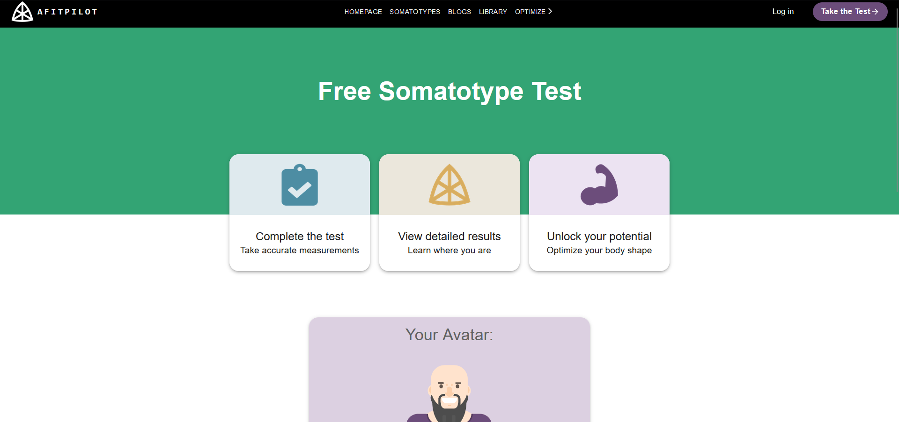

# Project during my internship

## [ ----> [View live](https://www.afitpilot.com) <---- ]

## About-the-project 🚀

This is the project during my internship as FullStack Developer at Walter Clayton.
The website allows you to understand the different body types, to know your body type
and to compare it. Your body type is generated in svg Avatar.

### 🛠 Built with

* 
* 
* 
* 
* 

## 💬 Contact

El miri younes - elmiri.younes@hotmail.com